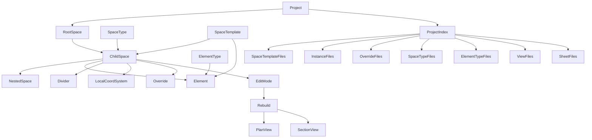

# Спецификация BIM-приложения на Unity и план обучения

## 1. Назначение документа

Этот документ фиксирует текущее видение BIM-приложения на Unity, основанного на сущности `Пространство`, и служит опорой для:

- проектирования модели данных;
- планирования MVP и этапов разработки;
- принятия архитектурных решений;
- подготовки учебного маршрута автора проекта.

Документ описывает прежде всего прототип-концепт, который должен подтвердить жизнеспособность ключевой идеи: модель здания строится не из набора слабо связанных объектов, а из иерархии `Пространств`, внутри которых размещаются и адаптируются остальные элементы.

## 2. Видение продукта

### 2.1. Главная идея

Ключевая сущность приложения - `Пространство`.

`Пространство` - это замкнутый 3D-объем, который:

- описывает часть здания;
- имеет место в иерархии здания;
- является базой для размещения других объектов;
- задает локальную систему координат;
- передает свойства потомкам;
- служит контекстом редактирования.

Вместо подхода, где модель состоит из множества отдельных слабо связанных элементов, приложение должно строить модель вокруг пространственной структуры здания:

- здание;
- корпуса;
- секции;
- этажи;
- квартиры;
- помещения;
- иные объемные зоны.

### 2.2. Ценность приложения

Приложение должно дать следующие преимущества:

- адаптивность модели к изменениям геометрии;
- быстрое моделирование объемов и основных архитектурных решений;
- автоматизированное формирование планов и разрезов;
- сокращение ручного труда при внесении изменений;
- прозрачное текстовое хранение модели;
- удобную интеграцию с внешними инструментами контроля версий;
- возможность доработки модели и внешними приложениями;
- более точную привязку каждого элемента к части здания;
- основу для будущей генерации вариантов модели, включая генерацию через LLM.

### 2.3. Целевые пользователи

Приложение ориентировано на несколько ролей:

- архитектор: формирует пространственную и архитектурную модель;
- конструктор: строит несущие элементы по границам Пространств;
- инженер: создает системы, потребителей, трассы и логические связи;
- BIM-координатор: поддерживает библиотеку типов, контролирует модель и правила;
- главный инженер: анализирует решения и формирует замечания.

### 2.4. Этапность развития продукта

Финальная цель - платформа для всех стадий проектирования и эксплуатации, но разработка начинается с прототипа-концепта.

Приоритет прототипа:

- проверить, работает ли модель на основе Пространств;
- проверить, можно ли обеспечить адаптивность элементов;
- проверить, насколько практично XML-хранение проекта;
- проверить возможность автоматического формирования видов;
- убедиться, что модель данных пригодна для дальнейшего роста.

## 3. Основные принципы предметной области

### 3.1. Пространство как базовая сущность

`Пространство` - универсальный контейнер для частей здания, но в первой очереди оно используется для архитектурных объемов.

Обязательные свойства Пространства:

- это замкнутый объем;
- у него не более одного родителя;
- оно может иметь несколько дочерних Пространств;
- дочерние Пространства не пересекаются;
- дочерние Пространства могут покрывать родительский объем не полностью;
- дочерние Пространства могут иметь разные типы;
- любое Пространство принадлежит дереву здания.

### 3.2. Иерархия

Иерархия модели строится сверху вниз:

`Проект -> Корневое Пространство -> Дочерние Пространства -> Элементы`

Примеры уровней иерархии:

- здание -> этаж -> помещение;
- здание -> секция -> этаж -> квартира -> помещение;
- здание -> атриум -> обслуживающие зоны.

### 3.3. Наследование

Свойства должны наследоваться:

- от родительского Пространства;
- от типа или стиля;
- от значения, заданного на самом экземпляре.

Приоритет значений:

`значение экземпляра -> значение типа -> значение родителя`

Наследование важно для:

- типов стен;
- типов полов;
- шаблонов Пространств;
- значений по умолчанию;
- параметров отображения;
- будущих правил проектирования.

### 3.4. Локальные координаты

Каждое Пространство имеет собственную локальную систему координат.

Принципы:

- начало координат Пространства совпадает с точкой его вставки в родительское Пространство;
- элементы внутри Пространства размещаются в его локальных координатах;
- при необходимости вычисляются значения в глобальной системе координат;
- положение элемента может задаваться прямоугольными или полярными координатами.

## 4. Концептуальная модель сущностей

### 4.1. Основные сущности

#### `Project`

Корневая сущность проекта. Хранит:

- метаданные проекта;
- индекс файлов;
- ссылки на корневые Пространства;
- ссылки на типы, шаблоны, виды и листы.

#### `Space`

Основная объемная сущность модели. Хранит:

- идентификатор;
- ссылку на родителя;
- ссылку на тип Пространства;
- ссылку на шаблон Пространства, если экземпляр создан на его основе;
- параметры размещения и локальную систему координат;
- параметры геометрии, если они заданы явно, а не получены из шаблона;
- набор разделителей;
- дочерние Пространства или ссылки на дочерние экземпляры;
- элементы, принадлежащие Пространству;
- локальные переопределения свойств.

#### `SpaceType`

Тип или стиль Пространства. Задает:

- свойства по умолчанию;
- назначение Пространства;
- шаблонные параметры;
- типовые значения отделки, стен, полов и других атрибутов.

Пример: стиль двухкомнатной квартиры.

#### `SpaceTemplate`

Шаблон составного Пространства или повторяющегося фрагмента модели. Задает:

- типовую структуру дочерних Пространств;
- типовые параметры геометрии и размещения;
- набор типовых элементов;
- точки вставки и локальные системы координат дочерних узлов;
- допустимые параметры и места локальных переопределений.

Примеры: типовая квартира, типовой этаж, типовая секция.

#### `Element`

Экземпляр элемента, принадлежащий одному Пространству.

В первой версии включает:

- стены;
- полы;
- окна;
- двери;
- крыши;
- мебель;
- базовые аннотации;
- размеры;
- подписи помещений.

Вне MVP, но в общем видении:

- оборудование;
- трубы;
- логические сети;
- конструктивные элементы.

#### `ElementType`

Тип элемента, на который ссылаются экземпляры.

Хранит:

- набор характерных свойств;
- набор компонентов;
- правила построения представления;
- значения по умолчанию.

Изменение типа должно обновлять представление экземпляров, не затирая локальные свойства экземпляра.

#### `View`

Сущность вида модели. Для MVP:

- 3D-вид;
- план;
- разрез.

#### `Sheet`

Чертежный лист, на который размещаются проекции видов и элементы оформления.

#### `Annotation`

Элементы оформления:

- размеры;
- марки;
- подписи помещений;
- иные 2D-объекты, связанные с видами.

### 4.2. Предпочтительная компонентная модель

На текущем этапе разумно описывать элементы как иерархические сущности с компонентами, а не как чистый ECS во всем приложении.

Предварительный компромисс:

- постоянные данные модели хранятся в объектной иерархии `Project / Space / Element / Type`;
- поведение и возможности элементов реализуются через компоненты;
- ECS-подобные структуры могут использоваться локально для задач редактирования, отображения, перестроения и временных вычислений;
- допускаются отдельные временные "миры" для редактируемого Пространства, вспомогательных объектов и элементов оформления.

Это позволяет сохранить:

- читаемую иерархию данных;
- удобство XML-сериализации;
- возможность оптимизации вычислений в будущем.

## 5. Геометрическая модель прототипа

### 5.1. Ограничения первой версии

В прототипе геометрия Пространств должна быть максимально ограниченной:

- только замкнутые объемы;
- построение только экструзией 2D-контура;
- контур плоский, замкнутый;
- контур состоит только из линейных сегментов;
- боковые грани вертикальные;
- верх и низ горизонтальные;
- пустоты внутри Пространства в MVP не поддерживаются.

### 5.2. Деление Пространств

Родительское Пространство делится набором разделителей.

На прототипном этапе разделители:

- задаются линиями из сегментов;
- идут от границы до границы или до другого разделителя;
- определяют области, в которые вставляются дочерние Пространства.

Геометрия дочернего Пространства должна определяться не произвольным редактированием тела, а тем объемом, который выделен ему внутри родителя.

### 5.3. Адаптация при изменениях

Ключевой принцип: элементы не должны терять смысл при изменении геометрии Пространства.

Предварительные правила:

- элементы размещаются относительно локальных систем координат, граней, ребер, линий или точек;
- при изменении геометрии Пространства приложение пытается перестроить элементы по их правилам привязки;
- если элемент больше нельзя корректно разместить, он не удаляется из описания;
- такой элемент переходит в состояние "неразмещен" или "невалиден";
- при последующих изменениях он может быть восстановлен автоматически;
- окончательное удаление требует явного действия пользователя.

## 6. Правила размещения элементов

### 6.1. Способы размещения

Для первой версии нужны следующие способы:

- по точке;
- по линии;
- по ребру;
- по плоскости;
- по грани;
- по оси.

### 6.2. Привязки

Возможные механизмы привязки, которые следует предусмотреть в модели данных, даже если они будут внедряться постепенно:

- абсолютное смещение в локальной системе координат;
- привязка к грани;
- привязка к ребру;
- расстояние до границы;
- центрирование;
- выравнивание по оси;
- равный шаг;
- привязка к уровню;
- правила перестроения.

### 6.3. Состояния элементов

Элемент в прототипе должен иметь хотя бы следующие состояния:

- валиден и размещен;
- временно не может быть размещен;
- содержит ошибки привязки;
- скрыт или не участвует в текущем представлении.

Это потребуется для адаптивности и диагностирования проблем после изменения Пространства.

## 7. Режимы работы пользователя

### 7.1. Основные режимы

Приложение должно поддерживать несколько режимов:

- просмотр модели;
- режим полета;
- редактирование выбранного Пространства;
- редактирование свойств;
- редактирование типов и стилей;
- создание видов;
- работа с замечаниями в будущем.

### 7.2. Редактирование Пространства

Редактирование должно быть локализовано.

При выборе Пространства в режим редактирования:

- редактируются элементы и разделители только выбранного Пространства;
- геометрия самого Пространства задается родительским Пространством;
- остальная модель блокируется для редактирования;
- соседние Пространства могут отображаться как контекст;
- изменения основной модели принимаются только после завершения редактирования и подтверждения.

Это решение нужно для:

- локализации изменений;
- снижения вычислительной нагрузки;
- будущей поддержки совместной работы;
- ясного разграничения ответственности в модели.

### 7.3. Undo/Redo

Для прототипа достаточно базовой поддержки:

- вернуться к исходному состоянию редактируемого Пространства до принятия изменений;
- сбросить незавершенные локальные правки;
- в будущем расширить до полноценной истории команд.

## 8. Виды, планы, разрезы и оформление

### 8.1. Базовая цель

На основе модели должны формироваться виды, являющиеся сечениями или проекциями 3D-модели.

Для MVP достаточно:

- 3D-вида;
- плана;
- разреза.

### 8.2. Правила для MVP

В прототипе:

- секущая плоскость стандартная: горизонтальная или вертикальная;
- отображение элементов единообразное, без развитой системы стилей вида;
- редактируемое Пространство может визуально выделяться;
- остальная модель может затеняться как фон;
- формируются размеры, марки и подписи помещений в минимально достаточном объеме.

### 8.3. Листы

Чертежный лист должен быть отдельной сущностью.

На текущем этапе лист нужен прежде всего как контейнер:

- для размещения видов;
- для хранения элементов оформления;
- для подготовки к будущему экспорту.

Экспорт в PDF и DWG не входит в MVP.

## 9. XML-хранение проекта

### 9.1. Причины выбора XML

Выбор XML основан на следующих преимуществах:

- читаемость человеком;
- простота сериализации;
- удобство для внешней обработки;
- пригодность для систем контроля версий;
- возможность ручного редактирования.

### 9.2. Общая структура хранения

Проект хранится как папка с текстовыми файлами.

Рекомендуемая структура:

```text
ProjectRoot/
  project.xml
  space-types/
    ...
  space-templates/
    apartments/
      ...
    floors/
      ...
    sections/
      ...
  instances/
    building/
      ...
    sections/
      ...
  overrides/
    sections/
      ...
  element-types/
    ...
  views/
    ...
  sheets/
    ...
  resources/        # не для MVP, но стоит зарезервировать
```

### 9.3. Минимальные правила хранения

- `project.xml` - корневой индексный файл проекта;
- каждый тип Пространства хранится в отдельном XML;
- каждый шаблон Пространства хранится в отдельном XML;
- каждый тип элемента хранится в отдельном XML;
- экземпляры Пространств группируются по крупным узлам модели, а не по одному файлу на каждое Пространство;
- повторяющиеся фрагменты здания должны храниться один раз как шаблоны и повторно использоваться по ссылке;
- для типовых этажей и секций должны поддерживаться диапазоны размещения, чтобы не дублировать одинаковые записи;
- локальные отличия от шаблонов должны храниться отдельно как `override` или `delta`, а не как полные копии экземпляров;
- каждый вид хранится в отдельном XML;
- листы хранятся отдельно;
- ссылки между сущностями описываются через ID;
- GUID обязательны как минимум для типов, шаблонов и стилей;
- геометрия хранится как параметры и операции построения, а не как финальная mesh-модель.

### 9.4. Индексный файл проекта

`project.xml` должен содержать:

- метаданные проекта;
- список корневых Пространств;
- ссылки на типы Пространств;
- ссылки на шаблоны Пространств;
- ссылки на файлы размещения экземпляров Пространств;
- ссылки на файлы локальных переопределений;
- ссылки на типы элементов;
- ссылки на виды;
- ссылки на листы;
- общие настройки проекта.

### 9.5. Требования к формату

Формат должен быть пригоден для ручного редактирования. Это означает:

- понятные имена узлов;
- минимум скрытой логики;
- стабильные ссылки;
- отсутствие обязательной бинарной сериализации;
- понятные значения по умолчанию;
- возможность быстро понять, где определен шаблон, а где размещен экземпляр;
- минимизацию объема повторяющихся данных без потери читаемости.

### 9.6. Открытые вопросы хранения

Пока не зафиксированы:

- версия XML-схемы;
- политика миграций;
- необходимость манифеста поверх индексного файла;
- формат подключения внешних библиотек типов;
- точная схема описания `override` и диапазонов размещения.

## 10. Проверки и валидность модели

Прототип должен закладывать основы для проверки модели.

Обязательные направления проверок:

- замкнутость объема Пространства;
- отсутствие пересечений Пространств;
- корректность деления родителя на дочерние области;
- допустимость размещения элементов на выбранных сущностях;
- валидность наследования и ссылок на типы;
- отслеживание элементов, которые сломались после изменений.

В дальнейшем должны поддерживаться:

- нормативные правила;
- пользовательские правила;
- предупреждения;
- ошибки;
- отчеты о проблемах модели.

## 11. Пользовательский интерфейс

### 11.1. Общий стиль

Интерфейс не должен повторять типичный CAD/BIM-подход с постоянным деревом и множеством закрепленных панелей.

Желаемое направление:

- игровой стиль взаимодействия;
- активные команды на панели быстрого доступа;
- сочетания клавиш;
- вывод части информации поверх сцены;
- дополнительные окна по требованию.

### 11.2. Представление дерева

Дерево Пространств и элементов должно скорее восприниматься как текстовый слой поверх сцены, чем как тяжелое отдельное окно.

### 11.3. Выбор объектов

Выбор должен поддерживать:

- выбор в 3D-сцене;
- выбор через текстовое дерево;
- в будущем, вероятно, поиск и фильтры.

### 11.4. Визуальные средства

В прототипе нужны:

- гизмо;
- точки вставки;
- визуализация локальных осей;
- инструменты деления Пространств;
- маркеры привязок и зависимостей.

## 12. Границы MVP

### 12.1. Что обязательно входит

MVP должен включать:

- создание Пространств;
- создание здания, этажей и комнат;
- размещение базовых архитектурных элементов;
- адаптацию элементов к изменению геометрии Пространств;
- запись и чтение модели в XML;
- сохранение изменений в процессе редактирования;
- отдельный режим просмотра и отдельный режим редактирования;
- формирование 3D-вида, плана и разреза;
- минимальные автоматические размеры, марки и подписи помещений.

### 12.2. Что не входит

На первом этапе не входят:

- связанные модели;
- совместная работа;
- печать и экспорт чертежей;
- IFC-экспорт;
- BCF-замечания;
- LLM-генерация модели;
- инженерные сети;
- конструктивные подсистемы каркаса.

### 12.3. Минимальный успешный сценарий

Первый сценарий, который подтверждает жизнеспособность подхода:

`создать здание -> разбить на этажи -> разбить на комнаты -> разместить окна и двери -> получить план`

### 12.4. Приоритет первого вертикального среза

Первый технический срез должен быть сбалансированным:

1. модель данных и XML;
2. базовый редактор Пространств;
3. минимальное размещение элементов;
4. построение простого плана.

Причина выбора такого среза:

- данные без редактора не проверят практичность модели;
- редактор без XML не проверит сохраняемость концепции;
- редактор без вида не докажет полезность для проектирования.

## 13. Рекомендуемая последовательность разработки

### Этап 1. Основа данных

Цель:

- зафиксировать формат сущностей и связей.

Результат:

- классы доменной модели;
- XML-схема проекта;
- загрузка и сохранение проекта;
- тестовый пример проекта.

### Этап 2. Пространства и деление

Цель:

- создать редактируемую пространственную структуру.

Результат:

- создание исходного Пространства;
- задание контура и высоты;
- деление Пространства разделителями;
- получение дочерних Пространств;
- локальные координаты и отображение границ.

### Этап 3. Базовые элементы

Цель:

- проверить размещение и адаптацию элементов.

Результат:

- стены, полы, окна, двери, мебель;
- привязки к точке, линии и грани;
- базовая логика перестроения при изменении Пространства;
- индикация невалидных элементов.

### Этап 4. Виды

Цель:

- доказать, что модель может давать полезную документацию.

Результат:

- 3D-вид;
- план;
- разрез;
- размеры, марки и подписи помещений в минимальном наборе.

### Этап 5. Полировка прототипа

Цель:

- сделать прототип пригодным для демонстрации и анализа.

Результат:

- улучшение UX;
- стабилизация сохранения;
- базовые проверки модели;
- подготовка примеров проектов.

## 14. Технические риски и открытые вопросы

### 14.1. Ключевые риски

- недостаточно точная модель привязок может сделать адаптивность нестабильной;
- слишком сложная геометрия на раннем этапе затормозит проект;
- попытка преждевременно внедрить полный ECS может усложнить сериализацию и отладку;
- автоматическая генерация размеров и марок может оказаться заметно сложнее, чем кажется;
- нестандартный интерфейс может дать хороший UX, но потребует больше экспериментов.

### 14.2. Открытые вопросы

- как именно описывать частичное переопределение свойств;
- какие свойства наследуются обязательно;
- как выглядит финальная схема компонентов элемента;
- как хранить состояние невалидных элементов;
- нужна ли версия XML-схемы уже в прототипе;
- как будут обновляться проектные типы из внешних библиотек;
- как именно оформлять блокировки и подтверждение изменений в режиме редактирования.

## 15. Долгосрочное развитие после MVP

После подтверждения концепции логично развивать:

- инженерные сети;
- конструктивные подсистемы;
- IFC и BCF;
- библиотеки типов и внешние подключения;
- совместную работу;
- правила и проверки модели;
- генерацию модели через LLM;
- экспорт чертежей;
- плагины и расширения.

## 16. План обучения под проект

### 16.1. Исходная точка

Текущая сильная сторона автора:

- хорошее понимание BIM-подходов и практики проектирования зданий.

Зоны, которые нужно развивать:

- Unity;
- C# как язык для крупного приложения;
- архитектура программных систем;
- математика для 2D/3D;
- алгоритмы геометрии;
- базовые алгоритмы и структуры данных.

### 16.2. Принцип обучения

Обучение должно быть не абстрактным, а привязанным к этапам создания приложения.

Правило:

- сначала изучать минимум, необходимый для ближайшего технического шага;
- затем сразу применять его в прототипе;
- после этого закреплять знания на следующем шаге.

### 16.3. Направление 1. Unity

Что изучить в первую очередь:

- структура Unity-проекта;
- сцены, GameObject, Component, Prefab;
- жизненный цикл MonoBehaviour;
- ввод пользователя;
- базовый UI;
- работа с камерой;
- материалы и меши;
- организация editor-time и runtime-кода;
- сборка desktop-приложения;
- основы отладки и профилирования.

Что особенно важно для этого проекта:

- работа со сценой и gizmo;
- построение и обновление mesh;
- пользовательские инструменты редактирования;
- сериализация данных вне стандартной Unity-сериализации;
- разделение доменной модели и визуального представления.

### 16.4. Направление 2. C#

Что усилить:

- классы и структуры;
- интерфейсы;
- наследование и композиция;
- generics;
- коллекции;
- события и делегаты;
- LINQ без злоупотребления;
- сериализация;
- обработка ошибок;
- тестируемый код;
- слоистая архитектура приложения.

Особенно важно:

- писать не "Unity-скрипты ради сцены", а нормальный прикладной код;
- держать доменную модель отдельно от визуализации;
- проектировать ясные контракты между слоями.

### 16.5. Направление 3. Математика

Минимум, который потребуется обязательно:

- векторы;
- длины и расстояния;
- скалярное произведение;
- векторное произведение;
- прямые и отрезки;
- плоскости;
- матрицы преобразований;
- локальные и глобальные системы координат;
- повороты;
- проекции;
- пересечения геометрических объектов.

Что особенно важно для этого проекта:

- переход между системами координат;
- работа с контурами и плоскостями;
- определение положения объектов относительно граней и ребер;
- вычисление площадей, объемов и центров.

### 16.6. Направление 4. Геометрические алгоритмы

Нужно изучать и постепенно реализовывать:

- полигоны и полилинии;
- проверка замкнутости контура;
- ориентация контура;
- экструзия 2D-контура в 3D-объем;
- разбиение контура линиями;
- определение принадлежности точки области;
- пересечения отрезков;
- построение сечений;
- триангуляция;
- генерация mesh;
- пространственные индексы;
- базовые графовые алгоритмы для логических связей и трассировки.

Что пока можно отложить:

- трассировку лучей как отдельную тему;
- сложные булевы операции над произвольными солидами;
- NURBS и продвинутую криволинейную геометрию.

### 16.7. Направление 5. Архитектура BIM-приложения

Нужно отдельно наработать понимание:

- как отделять доменную модель от сцены Unity;
- как проектировать стабильный формат хранения;
- как строить систему типов и экземпляров;
- как описывать наследование свойств;
- как проектировать режимы редактирования;
- как организовывать проверки модели и диагностику.

### 16.8. Порядок обучения по этапам проекта

#### Этап A. Подготовка к данным и XML

Изучить:

- основы Unity;
- базовый C#;
- XML-сериализацию;
- проектирование классов;
- принципы локальной и глобальной системы координат.

Практика:

- сделать простую консольную или Unity-сцену с загрузкой и сохранением `Project`, `Space`, `Element`.

#### Этап B. Подготовка к редактированию Пространств

Изучить:

- работа с пользовательским вводом в Unity;
- gizmo и интерактивные инструменты;
- 2D-геометрия контуров;
- отрезки, пересечения, разбиения.

Практика:

- инструмент создания контура;
- инструмент деления Пространства линиями;
- визуализация локальных осей.

#### Этап C. Подготовка к адаптивным элементам

Изучить:

- геометрические привязки;
- правила перестроения;
- событийную модель обновления;
- архитектуру компонентов.

Практика:

- окно на стене;
- дверь на границе;
- мебель по точке;
- перестроение после изменения границы помещения.

#### Этап D. Подготовка к видам

Изучить:

- плоскости сечения;
- проекции геометрии;
- генерацию 2D-представлений;
- автоматическое размещение аннотаций.

Практика:

- простой план;
- простой разрез;
- подпись помещения;
- линейный размер.

### 16.9. Формат личного обучения

Рекомендуемый режим:

- 20% времени на изучение теории;
- 80% времени на применение в проекте.

Хорошая практика:

- вести отдельный журнал решений и ошибок;
- для каждой новой темы делать маленький учебный прототип;
- не переходить к сложной геометрии, пока не стабилизированы контуры, экструзия и координаты;
- регулярно упрощать архитектуру, если она становится слишком сложной для текущего этапа.

## 17. Рекомендации по ближайшим действиям

Следующим шагом после этой спецификации стоит подготовить еще три документа:

1. `MVP-backlog` с конкретными задачами реализации.
2. Черновую модель классов и XML-схему.
3. Учебный план по неделям или спринтам.

## 18. Концептуальная схема


